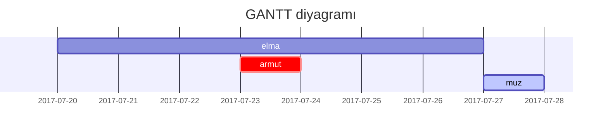
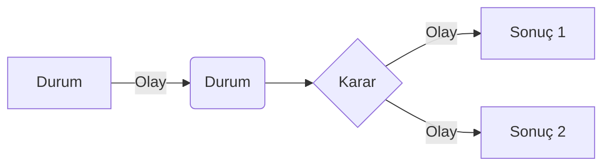

Bu gönderi, [**Chirpy**](https://github.com/cotes2020/jekyll-theme-chirpy)'de Markdown sözdiziminin nasıl görüntülendiğini göstermek içindir. Ayrıca sitenin tamamen hazır olmasından önce testler için dummy gönderi olarak kullanılmaktadır.

---
## Başlıklar

# H1 - Başlık

<h2 data-toc-skip>H2 - Başlık</h2>

<h3 data-toc-skip>H3 - Başlık</h3>

<h4>H4 - Başlık</h4>
---

## Paragraf

Lorem ipsum dolor sit amet, consectetur adipiscing elit. Nunc commodo quis lectus viverra porta. Phasellus dictum condimentum augue, eu tempor dui consectetur eu. Etiam commodo blandit justo aliquet tempus. Phasellus faucibus enim ut pulvinar condimentum. Pellentesque scelerisque sed urna a eleifend. Donec non libero ultrices, elementum quam quis, efficitur tortor. Etiam condimentum massa tortor, quis dignissim velit scelerisque at. Proin fringilla vestibulum ante et pretium. Integer tempor elit vehicula massa ultrices, id dictum ante sodales. Integer volutpat pellentesque tortor, hendrerit ultricies lectus. Pellentesque dignissim pellentesque dolor, vitae tincidunt nibh lobortis placerat. Sed pretium nunc vel turpis blandit, eu convallis sapien rutrum. Mauris condimentum molestie mi non volutpat. Donec mollis sit amet orci ut tincidunt. Ut id est finibus ex vehicula vulputate ut a nibh. Aliquam pellentesque sodales sapien, vel sagittis magna sollicitudin nec.

Sed pulvinar mollis gravida. Cras blandit massa nisl, vitae malesuada risus finibus at. Sed efficitur vehicula sapien, a aliquet massa porta at. Nunc molestie, augue sed suscipit semper, arcu justo bibendum purus, quis eleifend velit tortor ac orci. Quisque sit amet mollis tellus. Mauris diam justo, rutrum eu velit sed, fringilla condimentum libero. Donec est metus, tristique hendrerit ex et, imperdiet facilisis ante. Duis varius ullamcorper pellentesque. Nulla facilisi. Duis quis lorem vitae orci blandit molestie.

---

## Listeler

### Sıralı liste

1. Birinci
2. İkinci
3. Üçüncü

### Sırasız liste

- Bölüm
  - Kısım
    - Paragraf

### Yapılacaklar listesi

- [ ] Yapılacak
- [x] Yapıldı
- [ ] #123 sorunu düzeltilmeli
  - [x] JavaScript kodlarını gözden geçir
  - [ ] page.html sayfasına göz at
  - [ ] Sorunun çözüldüğüne emin olmak için test et

### Açıklama listesi

Güneş
: dünyanın etrafında döndüğü yıldız

Ay
: güneşten yansıyan ışıkla görülebilen dünyanın doğal uydusu

---

## Alıntı

> Bu satır bir _alıntı_ gösterir.

---

## Uyarılar

> Bu örnek `note` tipindeki uyarıyı gösterir.
{: .prompt-note }

> Bu örnek `warning` tipindeki uyarıyı gösterir.
{: .prompt-warning }

> Bu örnek `danger` tipindeki uyarıyı gösterir.
{: .prompt-danger }

---

## Tablolar

| Framework   | Dil        | Şablon Dili | Lisans     |
|:------------|:-----------|-------------|-----------:|
| Jekyll      | Ruby       | Liquid      | MIT        |
| Next.js     | JavaScript | React       | MIT        |
| Hugo        | Go         | Go          | Apache-2.0 |

---

## Linkler

<http://127.0.0.1:4000>

<https://github.com/ygtadk>

---

## Dipnot ekleme

Dipnota gitmek için tıkla[^dipnot1], bu da başka bir dipnot işareti[^dipnot2].

---

## Resimler

- Varsayılan (altyazı ile)

{: width="972" height="589" }
_Tam ekran genişliği ve merkez hizalama_

<br>

- Gölgeli

{: .shadow width="1548" height="864" style="max-width: 90%" }
_Gölge efektli resim (aydınlık temada görünür)_

<br>

- Sola hizalı

{: width="972" height="589" style="max-width: 70%" .normal}

<br>

- Sola doğru float

  {: width="972" height="589" style="max-width: 300px" .left}
  "Boşluğu doldurmak için tekrarlayan ve anlamsız bir metin. Boşluğu doldurmak için tekrarlayan ve anlamsız bir metin. Boşluğu doldurmak için tekrarlayan ve anlamsız bir metin. Boşluğu doldurmak için tekrarlayan ve anlamsız bir metin. Boşluğu doldurmak için tekrarlayan ve anlamsız bir metin."

<br>

- Sağa doğru float

  {: width="972" height="589" style="max-width: 300px" .right}
  "Boşluğu doldurmak için tekrarlayan ve anlamsız bir metin. Boşluğu doldurmak için tekrarlayan ve anlamsız bir metin. Boşluğu doldurmak için tekrarlayan ve anlamsız bir metin. Boşluğu doldurmak için tekrarlayan ve anlamsız bir metin. Boşluğu doldurmak için tekrarlayan ve anlamsız bir metin."

---

## Mermaid SVG

Mermamid ile GANTT diyagramı



Mermaid ile temel bir diyagram



---

## Matematik

Matematik işlemleri için [**MathJax**](https://www.mathjax.org/) kullanılmıştır.

$$ \sum_{n=1}^\infty 1/n^2 = \frac{\pi^2}{6} $$

$a \ne 0$ olduğunda, $ax^2 + bx + c = 0$ için iki çözüm vardır;

$$ x = {-b \pm \sqrt{b^2-4ac} \over 2a} $$

---

## Satır içi kod

Bu metin bir `satır içi kod` örneğidir.

---

## Dosyal yolu

Bu metin ise `/bir/dosya/yolu.rpm`{: .filepath} örneğidir.

---

## Kod bloğu

### Sıradan

```
Bu, sözdizimi vurgusu ve satır numarası olmayan sıradan bir kod parçacığıdır.
```

### Belirli diller

#### Konsol

```console
$ env |grep SHELL
SHELL=/usr/local/bin/bash
PYENV_SHELL=bash
```

#### Shell

```bash
if [ $? -ne 0 ]; then
    echo "The command was not successful.";
    #do the needful / exit
fi;
```

### Belirli dosya adı

```sass
@import
  "colors/light-typography",
  "colors/dark-typography"
```
{: file='_sass/jekyll-theme-chirpy.scss'}

---

## Dipnot

[^dipnot1]: Dipnot 1
[^dipnot2]: Dipnot 2
