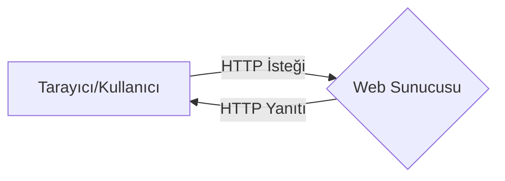
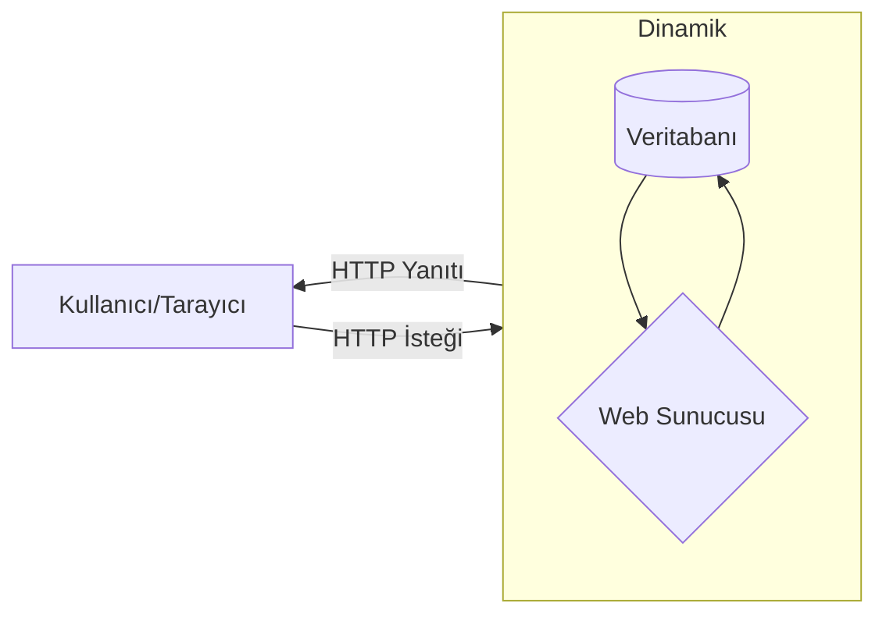

## Statik Web Siteler

Statik web sitelerinde, web sayfaları, HTML, CSS veya JavaScript gibi basit diller kullanılarak önceden oluşturulmuş kaynak kod dosyaları olan sunucu tarafından çalıştırılır. Statik web sitelerinde kullanıcı tarafından sunucu üzerinde herhangi bir içerik değişikliği yaplıması söz konusu değildir. Web sayfaları sunucu tarafından hiçbir değişiklik yapılmadan çalıştırılır. Bu nedenle statik web siteleri hızlıdır. Veritabanları ile etkileşim yoktur.

Bu tanımlama statik web sitelerinin kullanıcı eylemlerine yanıt vermeyeceği anlamına gelmez, bu web sitelerine statik denir çünkü bunlar sunucuda manipüle edilemez, değiştirilemez veya veritabanları ile etkileşime giremez.

Statik web sitesi için kullanıcı ile sunucu arasındaki ilişkiyi temsil eden grafik.

## Dinamik Web Siteler

Dinamik web sitelerinde, web sayfaları sunucu tarafından oluşturulur ve bu işlem sunucu çalışırken sürekli gerçekleşir, yani önceden oluşturulmuş web sayfaları yoktur. PHP, ASP.NET, Node.js gibi dillerle sunucu tarafında kullanıcının talebine göre web sayfaları oluşturulur. Bu nedenle, statik web sitelerinden daha yavaştırlar ancak kullanıcı tarafından içeriğin değiştirilmesi ve veritabanlarıyla etkileşim mümkündür

Dinamik web sitesi için sunucunun veritabanı ve kullanıcı ile arasındaki ilişkiyi temsil eden grafik.

## Farkları

| Statik Web Siteler | Dinamik Web Siteler |
| --- | --- |
| Web sayfalarının içeriği çalışma sırasında değiştirilemez. | Web sayfalarının içeriği çalışırken değiştirilebilir. |
| Veritabanı ile etkileşim mümkün değildir. | Veritabanı ile etkileşim mümkündür. |
| Dinamik sitelere göre hızlı yüklenirler. | Statik web sitelerinden daha yavaş yüklenebilirler. |
| Daha ucuz geliştirme maliyeti. | Daha fazla geliştirme maliyeti. |
| Web sitesini geliştirmek için HTML, CSS, Javascript kullanılmaktadır. | PHP, Node.js gibi sunucu tarafı dilleri kullanılmaktadır. |
| Sayfa her yüklendiğinde aynı içerik teslim edilir. | Sayfa her yüklendiğinde içerik değişebilir, değiştirilebilir. |